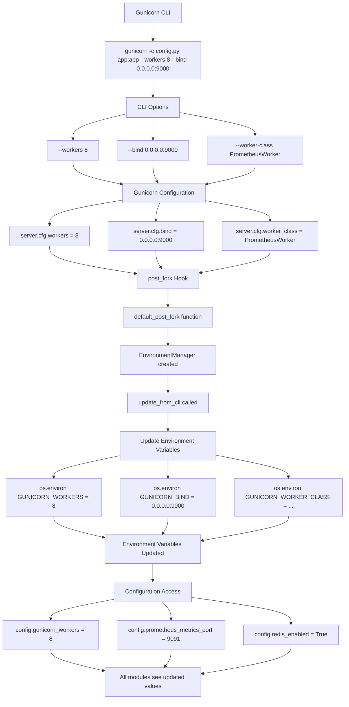

# Configuration Flow Diagram

This document provides a visual representation of how the Gunicorn Prometheus Exporter configuration system works.

## Configuration Loading Flow

```mermaid
flowchart TD
    A[Module Import] --> B[config.py module loaded]
    B --> C[Read env vars at module level]
    C --> D[PROMETHEUS_MULTIPROC_DIR = os.environ.get(...)]
    C --> E[GUNICORN_TIMEOUT = os.environ.get(...)]
    C --> F[GUNICORN_KEEPALIVE = os.environ.get(...)]

    D --> G[Singleton Creation]
    E --> G
    F --> G

    G --> H[config = ExporterConfig()]
    H --> I[__init__ method called]
    I --> J[_setup_multiproc_dir()]
    J --> K[Set PROMETHEUS_MULTIPROC_DIR if not set]

    K --> L[Property Access - Lazy Loading]
    L --> M[config.prometheus_metrics_port]
    L --> N[config.redis_enabled]
    L --> O[config.gunicorn_timeout]

    M --> P[os.environ.get with validation]
    N --> Q[Boolean conversion]
    O --> R[Integer conversion]

    P --> S[CLI Integration]
    Q --> S
    R --> S

    S --> T[EnvironmentManager.update_from_cli]
    T --> U[Update GUNICORN_WORKERS from CLI]
    T --> V[Update GUNICORN_BIND from CLI]
    T --> W[Update GUNICORN_WORKER_CLASS from CLI]

    U --> X[Runtime Usage]
    V --> X
    W --> X

    X --> Y[Application modules access config]
    Y --> Z[Lazy loading with validation]
    Y --> AA[Type conversion]
    Y --> BB[Error handling]
```

## Singleton Pattern Architecture

```mermaid
graph TB
    subgraph "config.py"
        A[ExporterConfig Class]
        B[__init__ method]
        C[Property: prometheus_metrics_port]
        D[Property: redis_enabled]
        E[Property: gunicorn_timeout]
        F[Global singleton instance]
        G[get_config function]

        A --> B
        A --> C
        A --> D
        A --> E
        F --> A
        G --> F
    end

    subgraph "Application Modules"
        H[hooks.py]
        I[metrics.py]
        J[master.py]
        K[plugin.py]
        L[__init__.py]
        M[backend/]
    end

    F --> H
    F --> I
    F --> J
    F --> K
    F --> L
    F --> M

    H --> N[port = config.prometheus_metrics_port]
    I --> O[dir = config.prometheus_multiproc_dir]
    J --> P[redis = config.redis_enabled]
    K --> Q[loglevel = config.get_gunicorn_config()]
    L --> R[Exports config and get_config]
    M --> S[prefix = config.redis_key_prefix]
```

## Environment Variable Processing Flow

```mermaid
flowchart TD
    subgraph "Environment Variables"
        A[PROMETHEUS_METRICS_PORT=9091]
        B[PROMETHEUS_BIND_ADDRESS=0.0.0.0]
        C[GUNICORN_WORKERS=4]
        D[REDIS_ENABLED=true]
        E[REDIS_HOST=localhost]
        F[REDIS_PORT=6379]
        G[GUNICORN_TIMEOUT=30]
        H[GUNICORN_KEEPALIVE=2]
    end

    A --> I[Property Access]
    B --> I
    C --> I
    D --> I
    E --> I
    F --> I
    G --> I
    H --> I

    I --> J[config.prometheus_metrics_port]
    I --> K[config.redis_enabled]
    I --> L[config.gunicorn_timeout]

    J --> M[os.environ.get with validation]
    M --> N[Type conversion: int(value)]
    N --> O[Return: 9091]

    K --> P[os.environ.get with default]
    P --> Q[String conversion: .lower()]
    Q --> R[Boolean check: in true values]
    R --> S[Return: True]

    L --> T[os.environ.get with default]
    T --> U[Type conversion: int]
    U --> V[Return: 30]

    O --> W[Application Usage]
    S --> W
    V --> W

    W --> X[hooks.py: port = 9091]
    W --> Y[metrics.py: dir = ~/.gunicorn_prometheus]
    W --> Z[master.py: redis_enabled = True]
    W --> AA[backend/manager.py: prefix = gunicorn]
```

## CLI Integration Flow



## Configuration Validation Flow

```mermaid
flowchart TD
    A[Property Access] --> B[config.prometheus_metrics_port]
    B --> C[Environment Variable Check]
    C --> D[os.environ.get with default None]

    D --> E{Value is None?}
    E -->|Yes| F[raise ValueError]
    E -->|No| G[Type Conversion]

    F --> H[Error Message: Environment variable must be set]
    H --> I[Example: export PROMETHEUS_METRICS_PORT=9091]

    G --> J[try: int(value)]
    J --> K{Conversion successful?}
    K -->|No| L[raise ValueError: Invalid port value]
    K -->|Yes| M[Range Validation]

    M --> N{Port between 1-65535?}
    N -->|No| O[raise ValueError: Port must be between 1 and 65535]
    N -->|Yes| P[Return valid port number]

    L --> Q[Error Handling]
    O --> Q
    P --> R[Success: Return validated value]

    style F fill:#ffcccc
    style L fill:#ffcccc
    style O fill:#ffcccc
    style P fill:#ccffcc
    style R fill:#ccffcc
```

## Best Practices

### 1. **Singleton Pattern Benefits**
- **Single Source of Truth**: One configuration instance for the entire application
- **Consistent State**: All modules access the same configuration values
- **Lazy Loading**: Environment variables are read only when needed
- **Thread Safety**: Safe for multi-threaded and multi-process environments
- **Memory Efficiency**: Only one configuration object exists in memory

### 2. **Environment Variable Management**
- **Required Variables**: Must be set in production, raise clear errors if missing
- **Optional Variables**: Have sensible defaults for development
- **Type Safety**: Automatic type conversion with validation
- **CLI Integration**: Gunicorn CLI options update environment variables

### 3. **Configuration Access Patterns**
- **Global Singleton**: `from gunicorn_prometheus_exporter.config import config`
- **Function-Based**: `from gunicorn_prometheus_exporter.config import get_config`
- **Module-Level**: `from gunicorn_prometheus_exporter import config`

### 4. **Error Handling**
- **Clear Error Messages**: Specific guidance on how to fix configuration issues
- **Graceful Degradation**: Fallback values for optional configuration
- **Validation**: Type and range checking for all configuration values

This configuration system ensures that the Gunicorn Prometheus Exporter has a robust, maintainable, and user-friendly configuration management approach that follows software engineering best practices.
