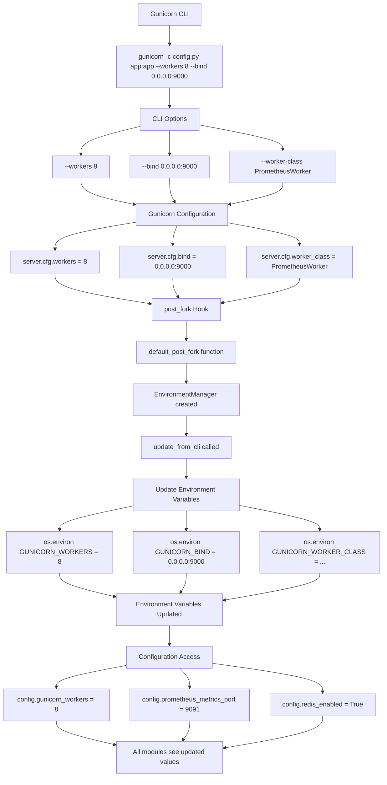

# Configuration Flow Diagram

This document provides a visual representation of how the Gunicorn Prometheus Exporter configuration system works with the ConfigManager pattern.

## Configuration Loading Flow

```mermaid
flowchart TD
    A[Application Startup] --> B[initialize_config() called]
    B --> C[ConfigManager.initialize()]
    C --> D[State: INITIALIZING]
    D --> E[Set environment variables]
    E --> F[Create ExporterConfig instance]
    F --> G[Validate configuration]
    G --> H{Validation successful?}

    H -->|No| I[State: ERROR]
    H -->|Yes| J[State: INITIALIZED]

    I --> K[Raise exception]
    J --> L[Configuration ready]

    L --> M[Property Access - Lazy Loading]
    M --> N[config.prometheus_metrics_port]
    M --> O[config.redis_enabled]
    M --> P[config.gunicorn_timeout]

    N --> Q[os.environ.get with validation]
    O --> R[Boolean conversion]
    P --> S[Integer conversion]

    Q --> T[CLI Integration]
    R --> T
    S --> T

    T --> U[EnvironmentManager.update_from_cli]
    U --> V[Update GUNICORN_WORKERS from CLI]
    U --> W[Update GUNICORN_BIND from CLI]
    U --> X[Update GUNICORN_WORKER_CLASS from CLI]

    V --> Y[Runtime Usage]
    W --> Y
    X --> Y

    Y --> Z[Application modules access config]
    Z --> AA[Lazy loading with validation]
    Z --> BB[Type conversion]
    Z --> CC[Error handling]

    Z --> DD[Application Shutdown]
    DD --> EE[cleanup_config() called]
    EE --> FF[ConfigManager.cleanup()]
    FF --> GG[State: CLEANUP]
    GG --> HH[Release resources]
```

## ConfigManager Pattern Architecture

```mermaid
graph TB
    subgraph "config/settings.py"
        A[ExporterConfig Class]
        B[__init__ method]
        C[Property: prometheus_metrics_port]
        D[Property: redis_enabled]
        E[Property: gunicorn_timeout]
    end

    subgraph "config/manager.py"
        F[ConfigManager Class]
        G[initialize method]
        H[get_config method]
        I[cleanup method]
        J[State management]
        K[Validation]
        L[Thread safety]
    end

    subgraph "config/__init__.py"
        M[Global functions]
        N[get_config_manager]
        O[initialize_config]
        P[get_config]
        Q[cleanup_config]
    end

    subgraph "Application Modules"
        R[hooks.py]
        S[metrics.py]
        T[master.py]
        U[plugin.py]
        V[__init__.py]
        W[backend/]
    end

    F --> A
    G --> A
    H --> A
    I --> A

    M --> F
    N --> F
    O --> G
    P --> H
    Q --> I

    P --> R
    P --> S
    P --> T
    P --> U
    P --> V
    P --> W

    R --> X[port = get_config().prometheus_metrics_port]
    S --> Y[dir = get_config().prometheus_multiproc_dir]
    T --> Z[redis = get_config().redis_enabled]
    U --> AA[loglevel = get_config().get_gunicorn_config()]
    V --> BB[Exports get_config function]
    W --> CC[prefix = get_config().redis_key_prefix]
```

## Environment Variable Processing Flow

```mermaid
flowchart TD
    subgraph "Environment Variables"
        A[PROMETHEUS_METRICS_PORT=9091]
        B[PROMETHEUS_BIND_ADDRESS=0.0.0.0]
        C[GUNICORN_WORKERS=4]
        D[REDIS_ENABLED=true]
        E[REDIS_HOST=localhost]
        F[REDIS_PORT=6379]
        G[GUNICORN_TIMEOUT=30]
        H[GUNICORN_KEEPALIVE=2]
    end

    A --> I[Property Access]
    B --> I
    C --> I
    D --> I
    E --> I
    F --> I
    G --> I
    H --> I

    I --> J[config.prometheus_metrics_port]
    I --> K[config.redis_enabled]
    I --> L[config.gunicorn_timeout]

    J --> M[os.environ.get with validation]
    M --> N[Type conversion: int(value)]
    N --> O[Return: 9091]

    K --> P[os.environ.get with default]
    P --> Q[String conversion: .lower()]
    Q --> R[Boolean check: in true values]
    R --> S[Return: True]

    L --> T[os.environ.get with default]
    T --> U[Type conversion: int]
    U --> V[Return: 30]

    O --> W[Application Usage]
    S --> W
    V --> W

    W --> X[hooks.py: port = 9091]
    W --> Y[metrics.py: dir = ~/.gunicorn_prometheus]
    W --> Z[master.py: redis_enabled = True]
    W --> AA[backend/manager.py: prefix = gunicorn]
```

## CLI Integration Flow



## Configuration Validation Flow

```mermaid
flowchart TD
    A[Property Access] --> B[config.prometheus_metrics_port]
    B --> C[Environment Variable Check]
    C --> D[os.environ.get with default None]

    D --> E{Value is None?}
    E -->|Yes| F[raise ValueError]
    E -->|No| G[Type Conversion]

    F --> H[Error Message: Environment variable must be set]
    H --> I[Example: export PROMETHEUS_METRICS_PORT=9091]

    G --> J[try: int(value)]
    J --> K{Conversion successful?}
    K -->|No| L[raise ValueError: Invalid port value]
    K -->|Yes| M[Range Validation]

    M --> N{Port between 1-65535?}
    N -->|No| O[raise ValueError: Port must be between 1 and 65535]
    N -->|Yes| P[Return valid port number]

    L --> Q[Error Handling]
    O --> Q
    P --> R[Success: Return validated value]

    style F fill:#ffcccc
    style L fill:#ffcccc
    style O fill:#ffcccc
    style P fill:#ccffcc
    style R fill:#ccffcc
```

## Best Practices

### 1. **ConfigManager Pattern Benefits**
- **Lifecycle Management**: Proper initialization, validation, and cleanup states
- **State Tracking**: Clear state transitions and error handling
- **Thread Safety**: Safe concurrent access with proper locking mechanisms
- **Validation Control**: Centralized validation with detailed error reporting
- **Resource Management**: Proper cleanup and resource management
- **Single Source of Truth**: One configuration instance for the entire application

### 2. **Environment Variable Management**
- **Required Variables**: Must be set in production, raise clear errors if missing
- **Optional Variables**: Have sensible defaults for development
- **Type Safety**: Automatic type conversion with validation
- **CLI Integration**: Gunicorn CLI options update environment variables
- **Initialization**: Call `initialize_config()` at application startup

### 3. **Configuration Access Patterns**
- **ConfigManager**: `from gunicorn_prometheus_exporter.config import get_config, initialize_config`
- **Direct Manager**: `from gunicorn_prometheus_exporter.config import ConfigManager`
- **Module-Level**: `from gunicorn_prometheus_exporter import get_config`

### 4. **Error Handling**
- **Clear Error Messages**: Specific guidance on how to fix configuration issues
- **Graceful Degradation**: Fallback values for optional configuration
- **Validation**: Type and range checking for all configuration values

This configuration system ensures that the Gunicorn Prometheus Exporter has a robust, maintainable, and user-friendly configuration management approach that follows software engineering best practices.
